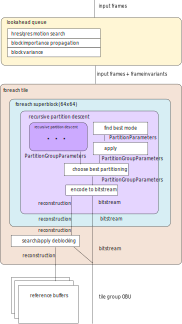
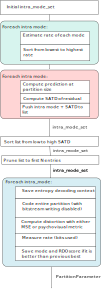
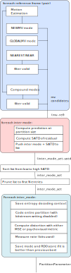

Introduction
--------------

The AV1 bitstream format allows a nearly limitless combination of ways to encode any particular video frame. The purpose of rav1e's RDO loop is to search this incredibly large space of probabilities and arrive at a single solution for each frame.

The parameter rav1e tries to optimize is "RDO score". This is computed as follows:

```score = distortion + rate*lambda```

Distortion is a metric selected based on user options, such as MSE for PSNR optimized mode or cdef-dist for psychovisual optimized mode. Rate is the number of bits used in the bitstream (commonly in 1/8 bit units throughout the codebase). Lambda is the current operating point (tradeoff between higher quality or lower bitrate), and is directly related to the quantizer setting.



The bitstream is composed of a hierarchy of units, and rav1e's RDO loops are structured in the same way. After computing some lookahead information, rav1e's first task is to split the frame into tiles (sometimes just one). These are processed completely independently, and usually in parallel.

The next split is into superblocks, which are currently always 64x64 pixels in the luma plane. rav1e processes superblocks serially, one at a time. Although choices made in a superblock affect later superblocks, rav1e will never revisit a superblock once it has determined the best way to code it - it writes it and continues on.

The next split is into partitions. Partitions are actually a tree structure, so the search here is recursive - rav1e has to compare treating the current level as a leaf node versus recursing further, all the way down the tree. To keep the number of permutations manageable, rav1e (in all speed levels but 0 and 1) traverses the tree in a top-down approach, and will stop splitting if the RDO score does not improve from the previous split. This can still potentially mean a large number of total combinations, though, so higher speed levels have a limited range of levels to search.

A single partition can be coded in either intra or inter mode. The searches for best intra and inter mode are described below.

Intra mode
------------



rav1e's intra mode search happens in 3 phases. The goals of these phases are to rapidly prune down a large list of candidates with fast methods, before doing a highly accurate but slow search for the final, best mode.

The first step sorts the intra modes based on their predicted coding cost.

The second step computes a rough distortion approximation based on the SATD of the residual upon applying the mode. The intra mode is applied at the full partition size, which is a crude approximation - if the transform size is smaller than the partition size, during coding the intra mode will be computed at the transform block size and the edges will be updated after each transform block is coded. The resulting list is sorted by SATD score, and the top half of the list is carried on to the next step.

The third step is to fully encode each mode (except for writing the bitstream). The real distortion and bitrate are measured, and the best mode is chosen.

Finally, the best mode is re-coded but with bitstream writing enabled, as during the final search the bitstream isn't actually written.

Inter mode
------------



rav1e's intra search starts with populating a list of inter modes to search. Modes such as NEWMV are always added, however modes such as NEARMV are only added if the current motion vector list is sufficiently long enough for them to be coded. Compound modes are added in a similar manner, if enabled.

Next, a rough distortion approximation based on SATD of the residual is computed. This is also computed at the partition level, however unlike intra mode, this is not an approximation. The resulting list is sorted and pruned to the best 9 entries.

Next, each of the modes is fully encoded (with bitstream write disabled). The real distortion and bitrate are measured, and the best mode is chosen.

Finally, the best mode is re-coded but with bitstream writing enabled.
