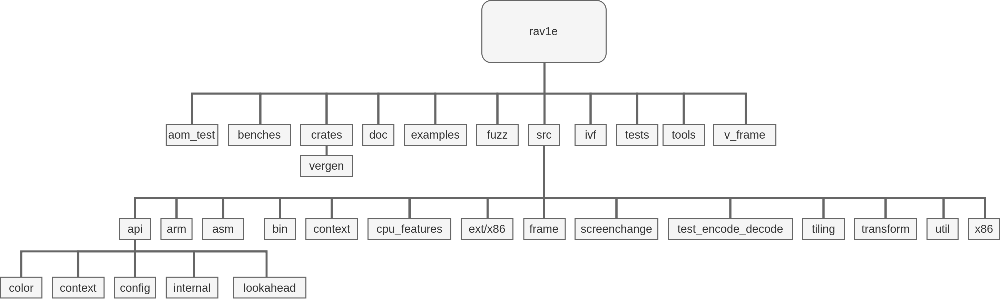

# File Structure of rav1e 0.4.0

<b>Table of Content</b>

- [High-level directory structure](#high-level-directory-structure)
- [Overview of `src/*`](#overview-of-src)

## High-level directory structure

Source: [draw.io](structure.draw.io)

##  Overview of `src/*`

The below table gives a brief overview of design of [`src/*`](../src/)

| Filename                                              | Functionality                                                                                              |
| ----------------------------------------------------- | ---------------------------------------------------------------------------------------------------------- |
| [activity.rs](../src/activity.rs)                     | Implementation of Activity masking functions for planes                                                    |
| [api/*.rs](../src/api/)                               | Contains public API of rav1e, for more information check [documentation](https://docs.rs/rav1e/)           |
| [arm/32/*.S](../src/arm/32/)                          | ARM optimised functions for different encoding tools imported from dav1d by release                        |
| [arm/64/*.S](../src/arm/64)                           | AArch64 optimised functions for different encoding tools imported from dav1d by release                    |
| [arm/asm.S](../src/arm/asm.S)                         | Common functions used for Assembly implementation                                                          |
| [arm/tables.S](../src/arm/tables.S)                   | Tables for various ARM optimised functions                                                                 |
| [asm/\*/*.rs](../src/asm/)                            | High-level functions for binding rust and assembly functions for x86 and AArch64 Architecture              |
| [bin/common.rs](../src/bin/common.rs)                 | Functions, enums, structures used command-line tool and debugging                                          |
| [bin/rav1e.rs](../src/bin/rav1e.rs)                   | CLI Interface for encoding from y4m files with rav1e                                                       |
| [bin/stats.rs](../src/bin/stats.rs)                   | Functions for displaying Frame summary, progress info, metrics of the encoding process                     |
| [bin/kv.rs](../src/bin/kv.rs)                         | Serialisation configuration of Key-value strings                                                           |
| [bin/errror.rs](../src/bin/error.rs)                  | Functions and enums to parse various errors and displaying                                                 |
| [bin/muxer/*.rs](../src/bin/muxer/)                   | Contains IVF Muxer functions for header definition, writing frames and flushing                            |
| [bin/decoder/*.rs](../src/bin/decoder/)               | Decoder related structures and functions                                                                   |
| [capi.rs](../src/capi.rs)                             | C Compatible API for using rav1e as a library                                                              |
| [cdef.rs](../src/cdef.rs)                             | CDEF Filter implementation for the encoder                                                                 |
| [context/*.rs](../src/context/)                       | High-level functions that write symbols to the bitstream, and maintain context                             |
| [cpu_features/*.rs](../src/cpu_features)              | Functions to toggle CPU optimisations for different architectures                                          |
| [deblock.rs](../src/deblock.rs)                       | Deblocking loop filter implementation for addressing blocking artifacts                                    |
| [dist.rs](../src/dist.rs)                             | SAD and SATD functions and implementation for various encoder functions                                    |
| [ec.rs](../src/ec.rs)                                 | Low-level implementation of the entropy coder, which directly writes the bitstream                         |
| [encoder.rs](../src/encoder.rs)                       | Low-level implementation of the AV1 encoder tools functions and structures                                 |
| [entropymode.rs](../src/entropymode.rs)               | Low-level implementation of entropy mode                                                                   |
| [ext/x86/x86inc.asm](../src/ext/x86/x86inc.asm)       | X86 Assembly header providing an easier way between different calling conventions (x86_32, win64, linux64) |
| [frame/*.rs](../src/frame/)                           | Misc encoder specific frame and plane enums apart                                                          |
| [fuzzing.rs](../src/fuzzing.rs)                       | Functions to initialise fuzz targets for encoder process                                                   |
| [header.rs](../src/header.rs)                         | The enums and structs of bitstream headers for writing                                                     |
| [lib.rs](../src/lib.rs)                               | The top level library, contains code to write headers, manage buffers, and iterate through each superblock |
| [lrf.rs](../src/lrf.rs)                               | Low-level implementation of Loop restoration filter                                                        |
| [mc.rs](../src/mc.rs)                                 | Low-level implementation of Motion Compensation of the encoding process                                    |
| [me.rs](../src/me.rs)                                 | Motion Estimation related structures and functions of the encoding process                                 |
| [partition.rs](../src/partition.rs)                   | Functions and enums to manage partitions (subdivisions of a superblock)                                    |
| [predict.rs](../src/predict.rs)                       | Intra and inter prediction implementations                                                                 |
| [quantize.rs](../src/quantize.rs)                     | Quantization and dequantization functions for coefficients                                                 |
| [rate.rs](../src/rate.rs)                             | Low-level implementation of rate control API (Constant Quantizer)                                          |
| [rdo.rs](../src/rdo.rs)                               | RDO-related structures and distortion computation functions                                                |
| [rdo_tables.rs](../src/rdo_tables.rs)                 | Set of RDO rate values used for RDO related calculation                                                    |
| [recon_intra.rs](../src/recon_intra.rs)               | Functions used for directional intra-prediction modes                                                      |
| [scan_order.rs](../src/scan_order.rs)                 | Functions definitions for various block-level scan orders                                                  |
| [scenechange/*.rs](../src/scenechange)                | Low-level implementation of fast screen-cut detection b/w frames for adaptive keyframe selection           |
| [segmentation.rs](../src/segmentation.rs)             | Top-level implementation of segmentation index coding                                                      |
| [test_encode_decode/*.rs](../src/test_encode_decode/) | Various encoder-decoder tests using dav1d and aom                                                          |
| [tiling/*.rs](../src/tiling/)                         | Implementation of tiling during encoding                                                                   |
| [token_cdfs.rs](../src/token_cdfs.rs)                 | Token cdf header for entropy mode                                                                          |
| [transform/*.rs](../src/transform)                    | Implementations of DCT and ADST transforms                                                                 |
| [util/*.rs](../src/util/)                             | Misc utility code                                                                                          |
| [x86/*.rs](../src/x86)                                | X86 optimised functions for various encoder functions along with functions imported from dav1d by release  |
